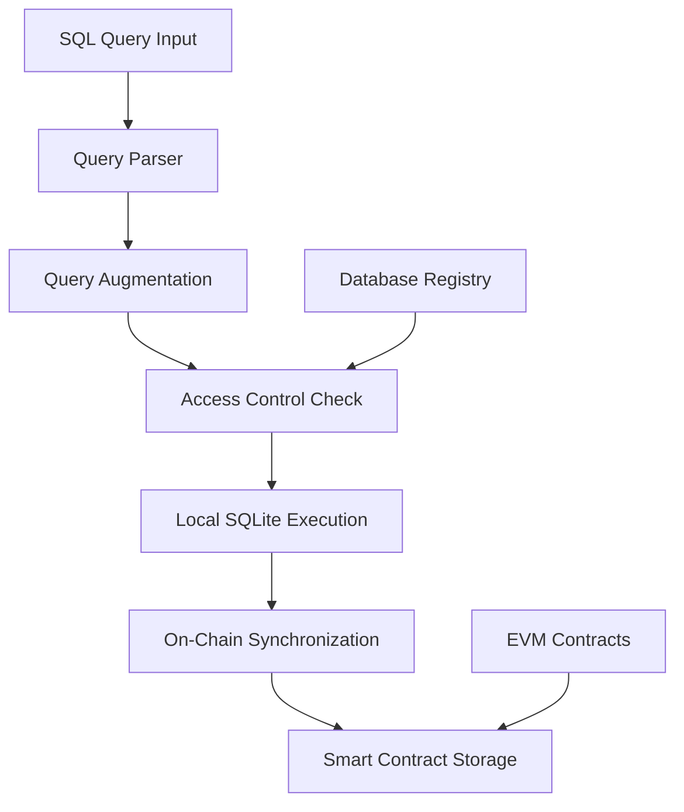

# SEI SQL Server - Hybrid On-Chain Database System

A TypeScript-based hybrid database system that combines traditional SQLite operations with Ethereum Virtual Machine (EVM) smart contracts to provide decentralized SQL database functionality.

## 🎯 Project Goals

The SEI SQL Server aims to create a **decentralized database infrastructure** that:

- **Bridges SQL and Blockchain**: Seamlessly integrate traditional SQL operations with on-chain data storage
- **Provides Data Persistence**: Ensure data integrity through blockchain immutability
- **Enables Decentralized Access**: Allow multiple parties to access and verify database operations
- **Maintains SQL Compatibility**: Support standard SQL operations (CREATE, INSERT, SELECT, DELETE) with minimal syntax changes
- **Ensures Type Safety**: Leverage TypeScript and Zod for robust data validation

## 🏗️ Architecture Overview

### Core Components

```
├── 📁 Root Layer (TypeScript/Bun Runtime)
│   ├── access.ts      - Database access control & registry
│   ├── engine.ts      - Main execution engine
│   ├── env.ts         - Environment configuration
│   └── sync.ts        - On-chain synchronization
│
├── 📁 parse/          - SQL Query Processing
│   ├── index.ts       - Query parsing & augmentation
│   └── utils.ts       - Database utility functions
│
├── 📁 evm/            - Blockchain Layer (Solidity)
│   ├── contracts/     - Smart contracts
│   │   ├── Table.sol           - Core table operations
│   │   ├── DatabaseFactory.sol - Database creation
│   │   └── Database.sol        - Database management
│   └── test/          - Contract tests
│
└── 📁 utils/          - Shared Utilities
    ├── zod.ts         - Data validation schemas
    └── tryCatch.ts    - Error handling utilities
```

### Data Flow



## 📊 Current Implementation Status

### ✅ Completed Features

#### Database Access Layer
- **Access Control System**: Database ownership and permission management (`access.ts`)
- **Database Registry**: Mapping between owners, database names, and blockchain addresses
- **Zod Validation**: Type-safe validation for EVM addresses and database records

#### SQL Query Processing
- **Query Parser**: SQL AST parsing using `node-sql-parser`
- **Query Augmentation**: Automatic injection of `sei_caret_onchain_index` for blockchain tracking
- **Supported Operations**: CREATE, INSERT, SELECT, DELETE query types
- **Type Safety**: Column type validation and constraint checking

#### Smart Contract Infrastructure
- **Table Contract**: Complete CRUD operations with type checking
- **DatabaseFactory**: Database creation and ownership management
- **Auxiliary Data Structures**: Efficient storage for column management
- **Hardhat Setup**: Development environment with testing framework

#### Utilities & Error Handling
- **Try-Catch Wrappers**: Consistent error handling patterns
- **Environment Management**: Configuration validation
- **TypeScript Support**: Full type safety across the codebase

### 🚧 In Progress Features

#### Query Execution Engine
- **Partial Implementation**: Basic query resolution framework exists
- **Missing**: Complete execution logic in `engine.ts`
- **Status**: Infrastructure in place, needs implementation

#### On-Chain Synchronization
- **Partial Implementation**: Sync framework exists in `sync.ts`
- **Missing**: Actual blockchain transaction submission
- **Status**: Ready for implementation

### ❌ Missing Features

1. **Complete Query Execution Pipeline**
2. **Blockchain Transaction Submission**
3. **Data Synchronization Logic**
4. **Error Recovery Mechanisms**
5. **Performance Optimization**
6. **Comprehensive Testing**

## 🚀 Installation & Setup

### Prerequisites

- **Bun Runtime**: Latest version
- **Node.js**: Version 18+
- **Git**: For version control

### Installation

```bash
# Clone the repository
git clone <repository-url>
cd sql-server

# Install dependencies
bun install

# Install EVM dependencies
cd evm && npm install
cd ..

# Set up environment variables
cp .env.example .env
# Edit .env with your configuration
```

### Environment Configuration

Create a `.env` file with:

```env
NODE_ENV=development
# Add additional environment variables as needed
```

## 💻 Usage Examples

### Basic Database Operations

```typescript
import { addDatabaseAccessRecord, execute } from './index';

// Register a new database
addDatabaseAccessRecord({
  owner: "0x1234567890123456789012345678901234567890",
  name: "my_database",
  address: "0x0987654321098765432109876543210987654321"
});

// Execute a SQL query
const result = await execute({
  query: "SELECT * FROM users WHERE age > 25",
  owner: "0x1234567890123456789012345678901234567890",
  name: "my_database"
});
```

### Smart Contract Deployment

```bash
cd evm
npx hardhat compile
npx hardhat test
npx hardhat node  # Start local blockchain
npx hardhat deploy --network localhost
```

## 🛠️ Development Tasks & Roadmap

### High Priority Tasks

1. **Complete Query Execution Engine** 🔴
   - Implement the missing execution logic in `engine.ts`
   - Connect SQL parsing to actual database operations
   - Add error handling and validation

2. **Implement On-Chain Synchronization** 🔴
   - Complete the `sync.ts` functionality
   - Add blockchain transaction submission
   - Implement data consistency checks

3. **Fix Query Parser Issues** 🟡
   - The `getAugmentedQuery` function has a logic error (unreachable return)
   - Add proper handling for UPDATE operations
   - Improve SELECT query column resolution

### Medium Priority Tasks

4. **Enhance Smart Contract Functionality** 🟡
   - Add more sophisticated query operations
   - Implement data indexing for better performance
   - Add access control mechanisms

5. **Add Comprehensive Testing** 🟡
   - Unit tests for all components
   - Integration tests for the full pipeline
   - Smart contract test coverage

6. **Performance Optimization** 🟡
   - Database connection pooling
   - Query result caching
   - Batch operation support

### Long-term Goals

7. **Production Readiness** 🔵
   - Error recovery and retry mechanisms
   - Monitoring and logging
   - Security audits

8. **Advanced Features** 🔵
   - Complex SQL query support (JOINs, subqueries)
   - Real-time data synchronization
   - Multi-chain support

## 🧪 Testing

### Running Tests

```bash
# Run TypeScript tests
bun test

# Run smart contract tests
cd evm && npx hardhat test

# Run specific test files
bun test test.ts
```

### Test Coverage

- **Current Coverage**: ~30% (basic functionality only)
- **Target Coverage**: 90%+ for production readiness

## 🤝 Contributing

### Development Workflow

1. **Fork** the repository
2. **Create** a feature branch: `git checkout -b feature/amazing-feature`
3. **Commit** your changes: `git commit -m 'Add amazing feature'`
4. **Push** to the branch: `git push origin feature/amazing-feature`
5. **Open** a Pull Request

### Code Standards

- **TypeScript**: Strict mode enabled
- **Formatting**: Use Prettier for consistent formatting
- **Linting**: ESLint configuration required
- **Testing**: All new features must include tests

### Debugging the Codebase

#### Current Known Issues

1. **Query Parser Logic Error**:
   ```typescript
   // In parse/index.ts, line 132
   throw new Error(`Unsupported query type: ${type}`);
   ```
   This line is unreachable due to previous return statements.

2. **Incomplete Utils Function**:
   ```typescript
   // In parse/utils.ts
   // getTableColumns function is commented out
   ```

3. **Empty Main Entry Point**:
   ```typescript
   // index.ts is completely empty
   ```

## 📚 API Documentation

### Core Functions

#### `addDatabaseAccessRecord(record)`
Registers a new database in the access control system.

#### `execute(options)`
Executes a SQL query with on-chain synchronization.

#### `getAugmentedQuery(query)`
Parses and augments SQL queries for blockchain compatibility.

## 🔒 Security Considerations

- **Access Control**: All database operations require proper authorization
- **Input Validation**: All inputs are validated using Zod schemas
- **SQL Injection Prevention**: Parameterized queries and AST parsing
- **Smart Contract Security**: Contracts follow OpenZeppelin standards

## 📄 License

[Add your license information here]

## 🆘 Support

- **Documentation**: [Link to detailed docs]
- **Issues**: Use GitHub Issues for bug reports
- **Discussions**: Use GitHub Discussions for questions
- **Contact**: [Your contact information]

---

**Last Updated**: [Current Date]
**Version**: 0.1.0 (Development)
**Contributors**: [List of contributors] 