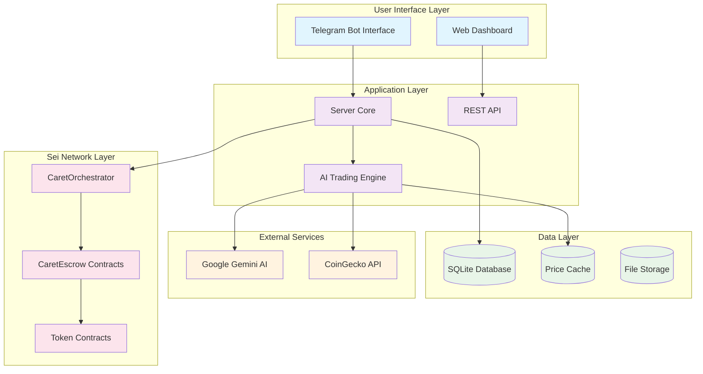
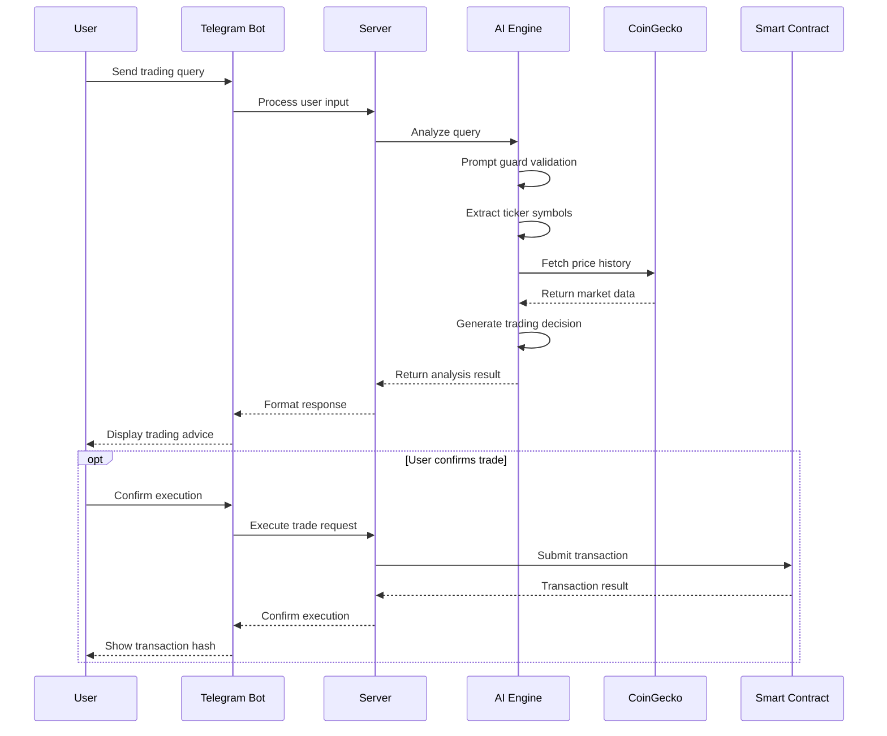
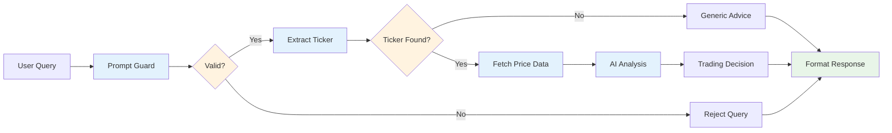
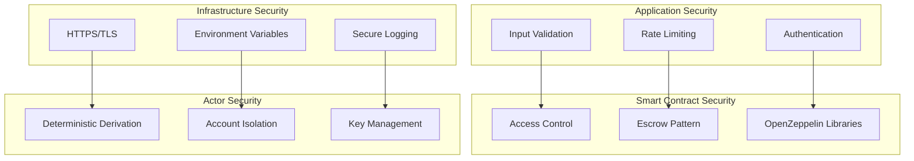

# Sei Trader - System Architecture

## 🏛️ High-Level Architecture

Sei Trader implements a modular, microservices-inspired architecture designed for scalability, security, and maintainability on the Sei Network.



---

## 🔄 Data Flow Architecture

### 1. User Query Processing Flow



### 2. AI Analysis Pipeline



---

## 🏗️ Component Architecture

### 1. AI Trading Engine (`src/bot/`)

#### Core Components
```typescript
// Main Agent class structure
class Agent {
  // AI model configuration
  private ai: GoogleGenAI;
  private model: ModelName;
  
  // Core workflows
  async enhancedWorkflow(userPrompt: string): Promise<WorkflowResult>;
  async promptGuard(prompt: string): Promise<PromptGuardResult>;
  async extractTicker(prompt: string): Promise<TokenExtractionResult>;
  async makeTradeDecision(ticker: string, data: PriceData): Promise<TradeDecision>;
}
```

#### Advanced Trading Agent
```typescript
class TradingAgentAdvanced extends Agent {
  // Enhanced analysis capabilities
  async technicalAnalysis(priceHistory: PriceData[]): Promise<TechnicalIndicators>;
  async riskAssessment(trade: TradeDecision): Promise<RiskMetrics>;
  async portfolioOptimization(holdings: Portfolio): Promise<Recommendations>;
}
```

#### Market Data System
```typescript
// CoinGecko integration architecture
interface MarketDataSystem {
  // Price history management
  getPriceHistory(symbol: string, days: number): Promise<PriceHistoryResult>;
  
  // Caching system
  getCachedData(symbol: string): PriceHistoryResult | null;
  setCachedData(symbol: string, data: PriceHistoryResult): void;
  
  // Background updates
  warmEssentialCache(): Promise<void>;
  backgroundFetchQueue: Set<string>;
}
```

### 2. Smart Contract Architecture

#### CaretOrchestrator Contract
```solidity
contract CaretOrchestrator {
    // State variables
    address public server;
    IERC20 public usdt;
    mapping(uint256 => address[]) public actors;
    mapping(address => bool) public isActor;
    mapping(address => address) public escrows;
    mapping(string => address) public tokens;
    
    // Core functions
    function registerActor(uint256 owner_, address actor_) external onlyServer;
    function registerToken(string memory name, string memory symbol) external onlyServer;
    
    // Access control
    modifier onlyServer() {
        require(msg.sender == server, "Not the server");
        _;
    }
}
```

#### CaretEscrow Contract
```solidity
contract CaretEscrow {
    // State management
    address public actor;
    CaretOrchestrator public orchestrator;
    
    // Fund management
    function balance(address token_) external view returns (uint256);
    function releaseFunds(address token_, address to_, uint256 amount_) external onlyServer;
    function fundActor(address token_, uint256 amount_) external onlyActor;
    
    // Security modifiers
    modifier onlyServer();
    modifier onlyActor();
}
```

### 3. Server Core Architecture

#### Request Processing Pipeline
```typescript
// Server request handler
export default {
  async fetch(req: Request): Promise<Response> {
    const url = new URL(req.url);
    
    // Route handling
    switch (url.pathname) {
      case "/health": return healthCheck();
      case "/tnc": return renderTerms();
      case "/api/ping": return apiPing();
      default: return notFound();
    }
  }
}
```

#### Database Schema
```sql
-- Core tables
CREATE TABLE user_agents (
  id INTEGER PRIMARY KEY AUTOINCREMENT,
  user_id INTEGER NOT NULL,
  agent_name TEXT NOT NULL UNIQUE,
  escrow_address TEXT NOT NULL,
  actor_address TEXT NOT NULL,
  created_at TIMESTAMP DEFAULT CURRENT_TIMESTAMP,
  updated_at TIMESTAMP DEFAULT CURRENT_TIMESTAMP
);

CREATE TABLE trade_history (
  id INTEGER PRIMARY KEY AUTOINCREMENT,
  agent_id INTEGER NOT NULL,
  token_symbol TEXT NOT NULL,
  trade_type TEXT NOT NULL, -- 'BUY' or 'SELL'
  amount DECIMAL(18,8) NOT NULL,
  price DECIMAL(18,8) NOT NULL,
  timestamp TIMESTAMP DEFAULT CURRENT_TIMESTAMP,
  tx_hash TEXT,
  FOREIGN KEY (agent_id) REFERENCES user_agents(id)
);

CREATE TABLE market_alerts (
  id INTEGER PRIMARY KEY AUTOINCREMENT,
  user_id INTEGER NOT NULL,
  token_symbol TEXT NOT NULL,
  condition_type TEXT NOT NULL, -- 'PRICE_ABOVE', 'PRICE_BELOW', etc.
  threshold_value DECIMAL(18,8) NOT NULL,
  is_active BOOLEAN DEFAULT 1,
  created_at TIMESTAMP DEFAULT CURRENT_TIMESTAMP
);
```

---

## 🔒 Security Architecture

### 1. Multi-Layer Security Model



### 2. Actor System Security

#### Deterministic Key Derivation
```typescript
export async function deriveActor(seed: string) {
  // Deterministic key generation
  const hash = keccak256(toBytes(seed));
  const pvtKey = hash as `0x${string}`;
  
  // Isolated wallet client
  return createWalletClient({
    chain: primaryChain,
    account: privateKeyToAccount(pvtKey),
    transport: http(primaryChain.rpcUrls.default.http[0]),
  }).extend(publicActions);
}
```

#### Security Features
- **Deterministic Generation**: Predictable actor addresses from user seeds
- **Account Isolation**: Each agent has separate blockchain account
- **Non-Custodial**: Server never holds user private keys
- **Escrow Protection**: Funds secured in smart contracts

### 3. API Security

#### Rate Limiting & Validation
```typescript
// Input validation schema
const TradeRequestSchema = z.object({
  agentId: z.number().positive(),
  tokenSymbol: z.string().min(1).max(10),
  amount: z.string().regex(/^\d+(\.\d+)?$/),
  action: z.enum(["BUY", "SELL"])
});

// Rate limiting implementation
const rateLimiter = new Map<string, RateLimit>();
const RATE_LIMIT = { requests: 10, window: 60000 }; // 10 requests per minute
```

---

## 📊 Performance Architecture

### 1. Caching Strategy

#### Multi-Level Caching
```typescript
// Cache hierarchy
interface CacheSystem {
  // L1: In-memory cache
  memoryCache: Map<string, CachedData>;
  
  // L2: File system cache
  diskCache: FileSystemCache;
  
  // L3: Database cache
  persistentCache: DatabaseCache;
}

// Cache configuration
const CACHE_CONFIG = {
  PRICE_DATA: { ttl: 5 * 60 * 1000 }, // 5 minutes
  MARKET_SUMMARY: { ttl: 10 * 60 * 1000 }, // 10 minutes
  TOKEN_METADATA: { ttl: 24 * 60 * 60 * 1000 }, // 24 hours
};
```

#### Background Processing
```typescript
// Background update system
class BackgroundProcessor {
  private updateQueue: Set<string> = new Set();
  private isProcessing: boolean = false;
  
  async scheduleUpdate(symbol: string): Promise<void>;
  async processQueue(): Promise<void>;
  async warmEssentialCache(): Promise<void>;
}
```

### 2. Database Optimization

#### Query Optimization
```sql
-- Optimized queries with indexes
CREATE INDEX idx_user_agents_user_id ON user_agents(user_id);
CREATE INDEX idx_trade_history_agent_id ON trade_history(agent_id);
CREATE INDEX idx_trade_history_timestamp ON trade_history(timestamp DESC);
CREATE INDEX idx_market_alerts_user_token ON market_alerts(user_id, token_symbol);
```

#### Connection Pooling
```typescript
// Database connection management
const dbConfig = {
  maxConnections: 10,
  idleTimeout: 30000,
  connectionTimeout: 5000,
  retryAttempts: 3
};
```

---

## 🌐 Network Architecture

### 1. Sei Network Integration

#### Chain Configuration
```typescript
// Network configuration
export const primaryChain = isProd ? seiTestnet : hardhat;

const seiConfig = {
  chainId: 713715, // Sei Testnet
  blockTime: 600, // ~600ms average
  finalityTime: 600, // Fast finality
  gasPrice: "minimal", // Low fees
  rpcUrls: {
    default: { http: ["https://evm-rpc-testnet.sei-apis.com"] }
  }
};
```

#### EVM Client Setup
```typescript
export const evmClient = createWalletClient({
  chain: primaryChain,
  account: privateKeyToAccount(env.PVT_KEY),
  transport: http(primaryChain.rpcUrls.default.http[0]),
}).extend(publicActions);
```

### 2. External API Integration

#### CoinGecko API Management
```typescript
// API configuration
const COINGECKO_CONFIG = {
  baseUrl: "https://api.coingecko.com/api/v3",
  rateLimit: { requests: 50, window: 60000 }, // 50 per minute
  retryConfig: { attempts: 3, backoff: "exponential" },
  timeout: 10000
};
```

#### Google AI Integration
```typescript
// Gemini AI configuration
const ai = new GoogleGenAI({
  apiKey: env.GOOGLE_API_KEY,
  httpOptions: {
    timeout: 30000,
    retries: 2
  }
});
```

---

## 🔄 Deployment Architecture

### 1. Environment Configuration

#### Development Setup
```bash
# Development environment
NODE_ENV=development
TG_BOT_TOKEN=dev_bot_token
GOOGLE_API_KEY=dev_gemini_key
PVT_KEY=0x_dev_private_key
PORT=3000
```

#### Production Setup
```bash
# Production environment
NODE_ENV=production
TG_BOT_TOKEN=prod_bot_token
GOOGLE_API_KEY=prod_gemini_key
PVT_KEY=0x_prod_private_key
PORT=8080
DATABASE_URL=production_db_url
```

### 2. Scaling Considerations

#### Horizontal Scaling
- **Stateless Design**: Server instances can be scaled horizontally
- **Database Sharding**: User data can be partitioned by user ID
- **Cache Distribution**: Redis cluster for shared caching
- **Load Balancing**: Multiple server instances behind load balancer

#### Vertical Scaling
- **Memory Optimization**: Efficient data structures and garbage collection
- **CPU Optimization**: Async processing and worker threads
- **I/O Optimization**: Connection pooling and batching

---

This architecture document provides the technical foundation for understanding and extending the Sei Trader system. Each component is designed for modularity, security, and performance on the Sei Network.
