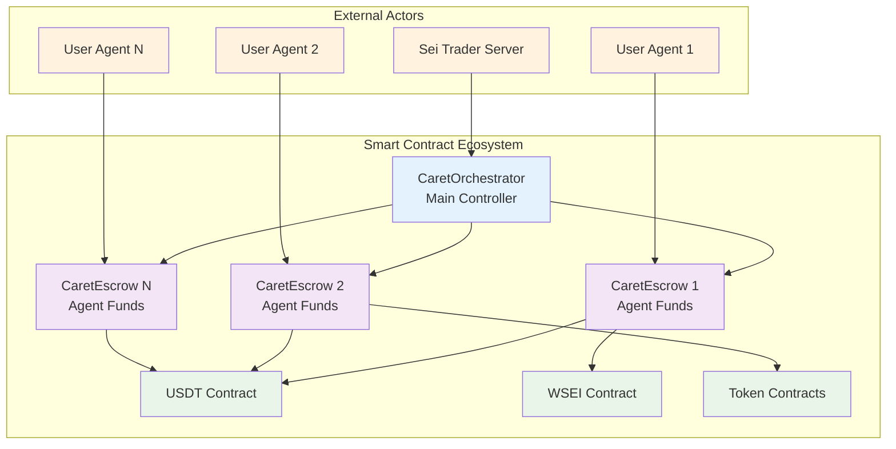
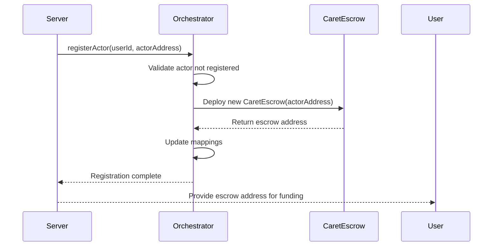
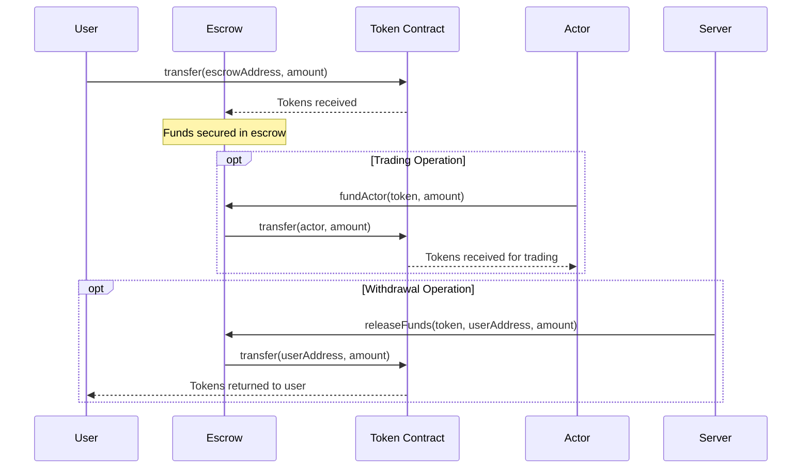
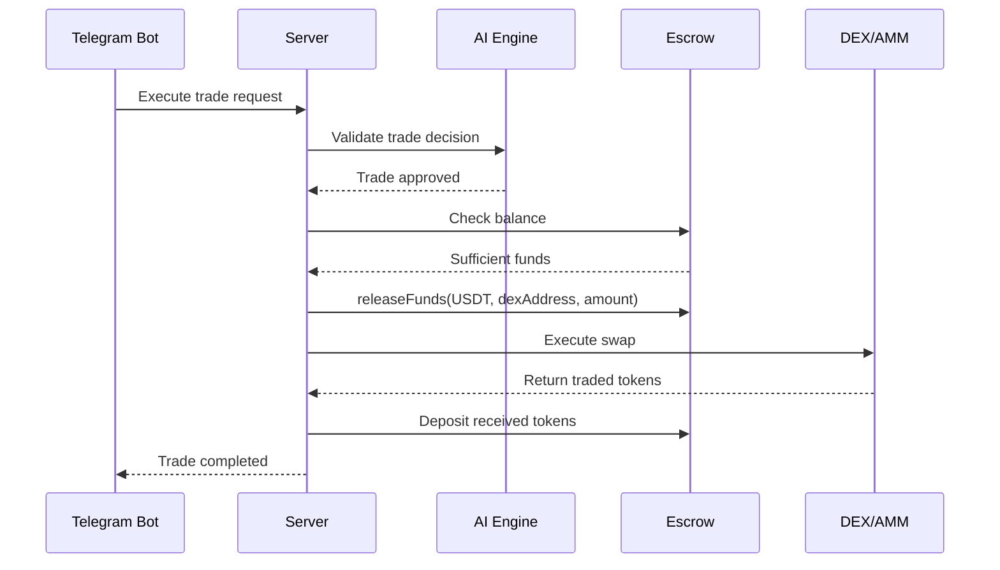

# Smart Contracts Documentation

## 🏛️ Contract Architecture Overview

Sei Trader's smart contract system implements a secure, modular architecture for managing trading agents and their associated funds on the Sei Network. The system consists of three core contracts working in harmony to provide a safe, non-custodial trading environment.



---

## 📋 Contract Specifications

### 1. CaretOrchestrator Contract

The `CaretOrchestrator` is the central management contract that coordinates all trading agents and their associated escrow contracts.

#### Contract Details
- **File**: `evm/src/CaretOrchestrator.sol`
- **Dependencies**: OpenZeppelin ERC20, CaretEscrow
- **Access Control**: Server-only operations with `onlyServer` modifier

#### State Variables
```solidity
contract CaretOrchestrator {
    address public server;                           // Authorized server address
    IERC20 public usdt;                             // USDT token contract reference
    mapping(uint256 => address[]) public actors;    // User ID → Actor addresses
    mapping(address => bool) public isActor;        // Actor registration status
    mapping(address => address) public escrows;     // Actor → Escrow mapping
    mapping(string => address) public tokens;       // Symbol → Token address
}
```

#### Core Functions

##### Constructor
```solidity
constructor(address server_, address usdt_)
```
**Purpose**: Initializes the orchestrator with server and USDT contract addresses
- `server_`: Address of the authorized Sei Trader server
- `usdt_`: Address of the USDT token contract

##### registerActor
```solidity
function registerActor(uint256 owner_, address actor_) external onlyServer
```
**Purpose**: Registers a new trading agent and deploys its escrow contract
- `owner_`: User ID who owns this agent
- `actor_`: Derived address of the trading agent
- **Creates**: New `CaretEscrow` contract for this agent
- **Updates**: `actors`, `isActor`, and `escrows` mappings

**Process Flow**:
1. Validates actor is not already registered
2. Adds actor to user's actor list
3. Marks actor as registered
4. Deploys new escrow contract
5. Maps actor to escrow address

##### registerToken
```solidity
function registerToken(string memory name, string memory symbol) external onlyServer returns (address)
```
**Purpose**: Registers a new trading token (for testing purposes)
- `name`: Full name of the token
- `symbol`: Trading symbol (e.g., "WSEI")
- **Returns**: Address of the deployed token contract
- **Note**: Used primarily for testnet token deployment

#### Security Features
- **Access Control**: Only the designated server can register actors and tokens
- **Validation**: Prevents duplicate actor registration
- **Immutable References**: Server and USDT addresses set at deployment

#### Usage Example
```typescript
// Deploy orchestrator
const orchestrator = await deployContract("CaretOrchestrator", [
  serverAddress,
  usdtAddress
]);

// Register a new agent
await orchestrator.registerActor(userId, actorAddress);

// Check if actor is registered
const isRegistered = await orchestrator.isActor(actorAddress);

// Get actor's escrow address
const escrowAddress = await orchestrator.escrows(actorAddress);
```

---

### 2. CaretEscrow Contract

Each trading agent has its own `CaretEscrow` contract that holds and manages the agent's funds securely.

#### Contract Details
- **File**: `evm/src/CaretEscrow.sol`
- **Dependencies**: CaretOrchestrator, OpenZeppelin ERC20
- **Access Control**: Server and Actor access patterns

#### State Variables
```solidity
contract CaretEscrow {
    address public owner;                    // Original owner (currently unused)
    address public actor;                    // Associated trading agent address
    CaretOrchestrator public orchestrator;   // Reference to orchestrator contract
}
```

#### Core Functions

##### Constructor
```solidity
constructor(address actor_)
```
**Purpose**: Initializes escrow for a specific trading agent
- `actor_`: Address of the trading agent this escrow serves
- **Auto-sets**: `orchestrator` to the deploying orchestrator contract

##### balance
```solidity
function balance(address token_) external view returns (uint256)
```
**Purpose**: Returns the balance of a specific token held in this escrow
- `token_`: Address of the ERC20 token to check
- **Returns**: Token balance in wei/smallest unit
- **Access**: Public view function

##### releaseFunds
```solidity
function releaseFunds(address token_, address to_, uint256 amount_) external onlyServer
```
**Purpose**: Allows the server to release funds from escrow
- `token_`: ERC20 token address to transfer
- `to_`: Recipient address
- `amount_`: Amount to transfer (in wei/smallest unit)
- **Access**: Server only
- **Use Case**: Trade execution, withdrawals

##### fundActor
```solidity
function fundActor(address token_, uint256 amount_) external onlyActor
```
**Purpose**: Allows the agent to withdraw funds for trading
- `token_`: ERC20 token to withdraw
- `amount_`: Amount to withdraw
- **Access**: Actor only
- **Use Case**: Moving funds for decentralized trading

#### Security Modifiers

##### onlyServer
```solidity
modifier onlyServer() {
    require(msg.sender == address(orchestrator.server()), "Not the server");
    _;
}
```
**Purpose**: Restricts function access to the authorized server only

##### onlyActor
```solidity
modifier onlyActor() {
    require(msg.sender == actor, "Not the actor");
    _;
}
```
**Purpose**: Restricts function access to the associated trading agent only

#### Usage Examples

```typescript
// Check escrow balance
const usdtBalance = await escrowContract.balance(usdtAddress);
console.log(`Escrow holds ${formatUnits(usdtBalance, 6)} USDT`);

// Server releases funds (for withdrawals)
await escrowContract.releaseFunds(
  usdtAddress,
  userWalletAddress,
  parseUnits("100", 6) // 100 USDT
);

// Actor withdraws funds (for trading)
await actorWallet.writeContract({
  address: escrowAddress,
  abi: escrowAbi,
  functionName: "fundActor",
  args: [usdtAddress, parseUnits("50", 6)] // 50 USDT
});
```

---

### 3. TestToken Contract

For testing and development purposes, the system includes a simple ERC20 token implementation.

#### Contract Details
- **File**: `evm/src/TestToken.sol`
- **Purpose**: Testing token for development and testnet deployment
- **Features**: Standard ERC20 with minting capabilities

#### Implementation
```solidity
contract TestToken is ERC20 {
    constructor(
        string memory name,
        string memory symbol,
        address mintTo
    ) ERC20(name, symbol) {
        _mint(mintTo, 1000000 * 10**decimals()); // Mint 1M tokens
    }
}
```

---

## 🔄 Contract Interaction Flows

### 1. Agent Registration Flow



### 2. Fund Management Flow



### 3. Trading Execution Flow



---

## 🔧 Development & Deployment

### 1. Contract Compilation

```bash
# Navigate to EVM directory
cd evm

# Install dependencies
bun install

# Compile contracts
bun run compile
```

### 2. Contract Deployment

```bash
# Deploy to testnet
bun run migrate
```

#### Deployment Script
```typescript
// scripts/deploy.ts
import { deployContract } from "./utils";

async function main() {
  // Deploy USDT token (for testing)
  const usdt = await deployContract("TestToken", [
    "Test USDT",
    "USDT",
    serverAddress
  ]);
  
  // Deploy orchestrator
  const orchestrator = await deployContract("CaretOrchestrator", [
    serverAddress,
    usdt.address
  ]);
  
  console.log("Contracts deployed:");
  console.log("USDT:", usdt.address);
  console.log("Orchestrator:", orchestrator.address);
}
```

### 3. Contract Verification

```bash
# Verify on Sei explorer
npx hardhat verify --network sei <contract_address> <constructor_args>
```

---

## 🛡️ Security Considerations

### 1. Access Control
- **Server Authority**: Only the designated server can register actors and release funds
- **Actor Isolation**: Each agent can only access its own escrow
- **Immutable Settings**: Critical addresses set at deployment time

### 2. Fund Safety
- **Escrow Pattern**: Funds held in separate contracts per agent
- **Non-Custodial**: Server cannot directly access user funds
- **Atomic Operations**: All fund movements are atomic transactions

### 3. Upgrade Path
- **Proxy Pattern**: Consider implementing upgradeable contracts for future versions
- **Migration Strategy**: Plan for smooth migration of funds if contract upgrades needed
- **Emergency Procedures**: Implement emergency pause/withdrawal mechanisms

### 4. Audit Recommendations
- **OpenZeppelin**: Using battle-tested libraries
- **External Audit**: Consider professional security audit before mainnet
- **Bug Bounty**: Implement bug bounty program for community security review

---

## 📊 Gas Optimization

### 1. Efficient Storage
- **Packed Structs**: Use appropriate data types to minimize storage slots
- **Mapping vs Arrays**: Choose optimal data structures for access patterns
- **Event Logging**: Use events for historical data instead of storage

### 2. Function Optimization
- **Batch Operations**: Support multiple operations in single transaction
- **Gas Estimation**: Provide accurate gas estimates for frontend
- **Optional Parameters**: Use function overloads to reduce unnecessary parameters

### 3. Sei Network Benefits
- **Low Gas Costs**: Sei's efficient consensus reduces transaction costs
- **Fast Finality**: Quick transaction confirmation improves user experience
- **EVM Compatibility**: Standard Ethereum tooling works seamlessly

---

This contract documentation provides a comprehensive guide to understanding, deploying, and interacting with the Sei Trader smart contract system. The modular design ensures security, scalability, and maintainability for the trading platform.
